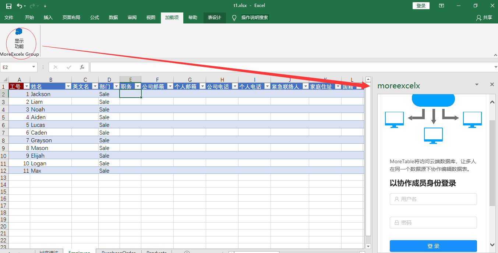

# 从一个例子开始

下面我们从一个案例开始。在开始之前，我们先确认您使用的是Office Excel 2016版本及以上，包括Office 365和最新的2019版本，操作系统平台包括windows，Mac和Office online。

> 注意，由于Excel技术的限制，必须要用Office 2016及以上版本，不支持2007，2010，2013，也不支持WPS。

## 打开MoreTable插件

按照如图方式打开插件，如果找不到按钮，请升级您的Office版本到最新。

