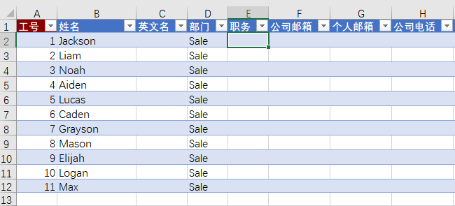
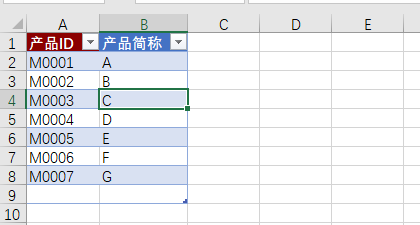
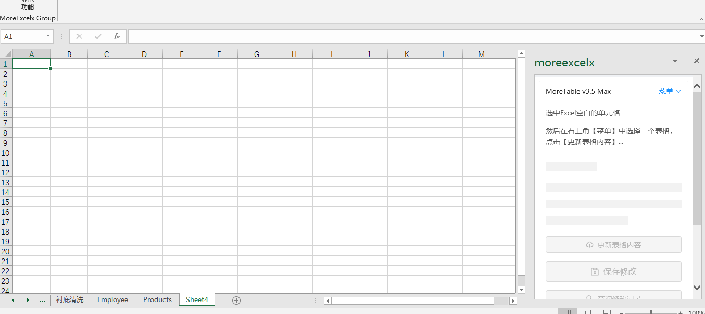
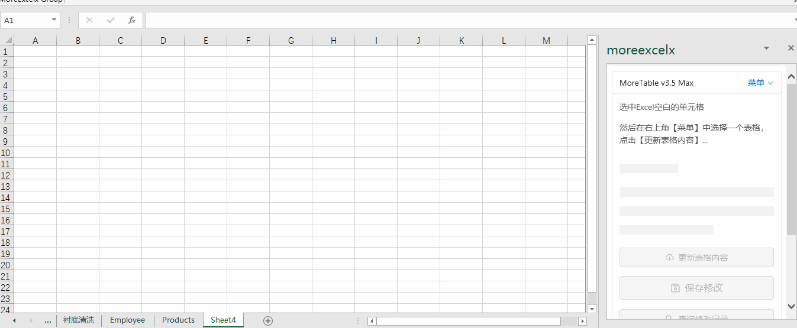
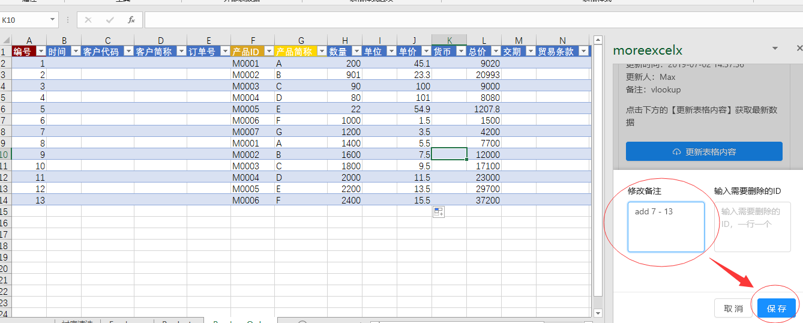

# 从一个例子开始

下面我们从一个案例开始。在开始之前，我们先确认你电脑上有Office软件（而不是WPS）。

本系统由一个MoreExcel管理平台和Excel客户端组成。你需要

1. 注册[MoreExcel管理平台](https://me3.6erp.cn/admin/)
2. 安装[MoreTable插件，有两个客户端，请根据Office版本下载](https://www.6erp.cn/portfoliotype/moreexcel3)

## 打开MoreTable插件

按照如图方式打开插件，如果找不到按钮，请升级您的Office版本到最新。

### 以协作者身份登录

请确保您已经在[MoreExcel管理平台](https://me3.6erp.cn/admin/)中注册。

管理员会分配若干个协作者账号并分配它们的权限。您需要获得用户名和密码，然后在插件上登录。

> 如果您仅仅要试用，可以发送邮件service@6erp.cn，向我们索取一个协作者账号

## 开始例子之前的说明

MoreTable是依赖于[MoreExcel管理平台](https://me3.6erp.cn/mex/admin/home/)的。我们特意准备了一个账套（profile），并定义了三个表格，和若干个协作者账号。这三个表格分别是：Employee，PurchaseOrder，Products。分别代表雇员，订单表，产品资料。这三个表可以模拟一个简单的CRM系统。

PurchaseOrder订单表引用了Employee雇员和Products产品资料两个表的资料。管理员在定义协作者权限的时候，可以把Employee和Products两个表（属于基础资料）分配给一个单独的协作者来维护；其它协作者只能浏览和引用。

假设您是一个业务员（Salesman），您的职责是，当客户下订单时，在PurchaseOrder表格里录入一笔订单，注明填表人，录入产品信息，价格等，并随时查看订单合计统计。

## 更新表格内容

这是第一次登录后的状态，请按照如下步骤

1. 选中一个空白单元格。最好是左上角第一个（其它单元格也可），最好这个工作表没有任何内容，您可以准备一个新文件。
2. 在右侧的插件中，点击右上角的【菜单】，选择表格【PurchaseOrder】。
3. 点击下方蓝色的【更新表格内容】。

具体步骤参看如下动图

**【更新表格内容】**，相当于您从数据库中读取了表格的最新内容，如果其它协作者有编辑，它会载入他人最新的编辑结果。请在编辑表格之前，先做【更新表格内容】，确保数据最新。

## 编辑表格

和正常的Excel编辑是一样的。

> MoreTable使用了Excel的表格功能（请[访问office文档](https://support.office.com/zh-cn/article/excel-%e8%a1%a8%e6%a6%82%e8%bf%b0-7ab0bb7d-3a9e-4b56-a3c9-6c94334e492c?ocmsassetID=HA010048546&CorrelationId=308e1fb9-8ab2-474d-9551-98235cc08723&ui=zh-CN&rs=zh-CN&ad=CN)）。

## 保存修改

做完表格录入后，您还需要保存表格到数据库。注意，这里的保存表格不是保存Excel文件（当然您最好也保存Excel文件），而是提交表格到数据库，便于其它协作者操作。

步骤：

1. 点击红色的【保存修改】。
2. 在打开的对话框中，注明一下修改备注（我们强烈建议写一些提要，便于他人参考和追溯）。
3. 点击对话框中的【保存】按钮。

这样，新编辑的内容就会被保存到数据库中。

