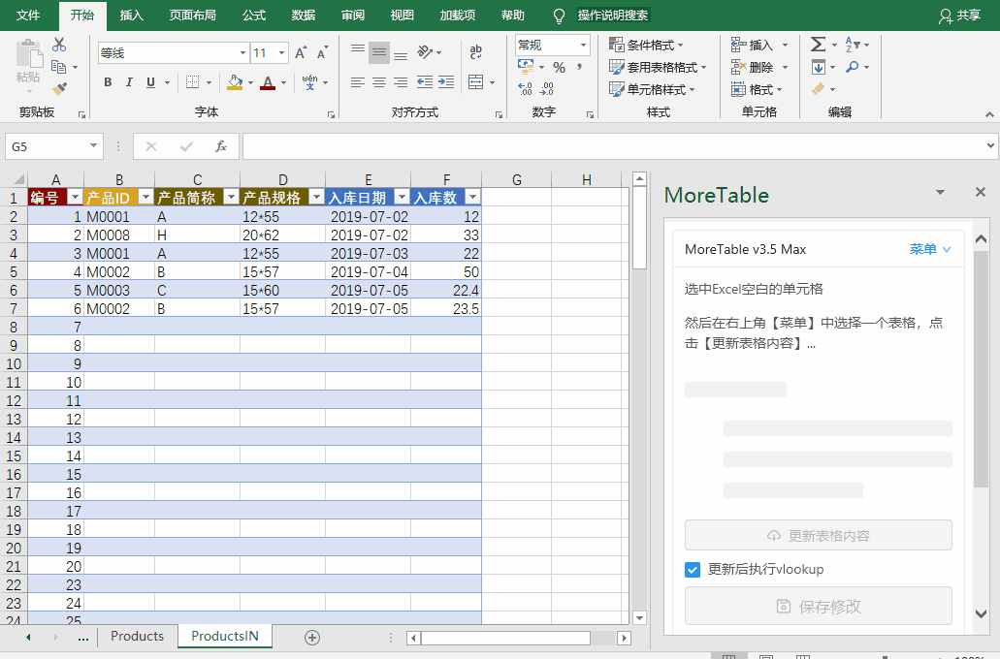

# 辅助编辑利器 -- 录入相关

> 本章节开始涉及跨表的数据借用，在此之前，请先了解一下[处理函数公式的同步](addin_formula)。

## 应用场景

用一个例子来说明

由两个表：物料表和发货表。其中发货表的【物料名称】是来自于物料表的【物料名称】，可以重复但录入的值必须符合物料表。

发货表的【物料名称】列就录入相关列。

录入相关体现两个功能目标

- 辅助快速录入
- 防止录入错误

## MoreTable的录入相关效果

当选中【录入相关】列的某个单元格时，右侧的窗口会自动出现一个输入框。在这个输入内输入内容，可以有类似百度搜索框的效果，自动提示可能的值，并提供选择。

### 为什么不在Excel单元格上显示下拉菜单？

这是非常理想的功能，可惜Excel软件本身不支持。

### 能不能直接在【录入相关】列上直接录入或者粘贴

实际上是可以的。如果内容比较多的情况下，建议您直接粘贴，而避免一个一个录入。

### 录入防错

【录入相关】列的特性是限定这列的录入内容只能来自其它表格的某列（这是MoreExcel管理平台定义好的，普通用户不能修改）。实际录入的时候，您可以录入范围之外的值。但是在保存的时候，系统会检查并报错。

> 总结：录入超范围之外的内容会被阻止，也就不能同步。

### 【录入相关】并没有出现下拉框，或者内容不全

确保没有错误提示的前提下，有两种可能。

- 您的录入没有匹配的内容。比如关联的表格没有内容（没有保存也就没有内容）。
- 【录入相关】可以设置一些过滤条件，有可能您的账号被限制了，请咨询管理员。

### 为什么不能直接用公式引用

Excel的函数公式必须保证数据源，数据引用都是从其它表格引用的。在MoreExcel管理平台下，被引用的表格未必能浏览器，也就没有数据源。而【录入相关】列的功能能克服这个问题。
