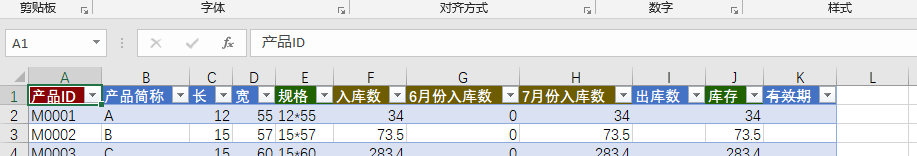

# 处理增删行列

> 看本章节前，请先了解[标准的Excel表格](addin_update)。

## 禁止增删列

表格列代表着表格样式，表格样式是通过MoreExcel管理平台定义的，所以您不可以修改，包括不能修改每个列的类型。

> 如果您手工增删列，操作【更新表格内容】或者【保存修改】都会报错。

## 增加行

MoreTable当然允许增加行，不然怎么录入数据呢。

### 了解KEY列

表格会存入数据库，如果您了解一点数据库的基本知识，那么数据表肯定会包含一个ID，类似于身份证，放在MoreTable里就是KEY列。上图中的深红色列就是KEY列。

KEY列是识别一行的标志。如果KEY列那个单元格是空白，整列内容都不会被保存。

同时，**KEY列的内容必须有且不重复**。

### 被禁止增删行

有些用户会被管理员禁止增删行（比如他们只能根据前面的录入补录入）。那么他的KEY列应该是被禁止录入的（默认情况下有一条中划线）。他是无法录入KEY列并成功保存的，变相代表他没有增删列的权限。

## 删除行

一般我们删除行的时候，可以直接用Excel的删行功能。可是，这样的操作不会被MoreTable认可。MoreTable必须指定要删除的KEY列的值。

当点击【保存修改】按钮的时候，在弹出的对话框中录入需要删除的KEY。

