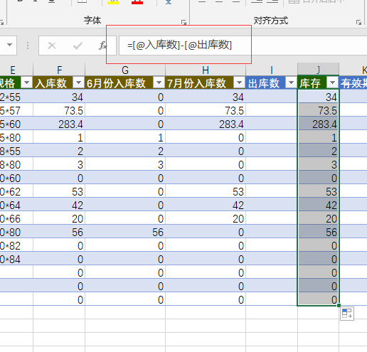
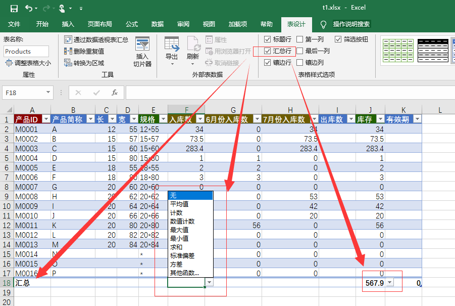

# 处理函数公式的同步

Excel会用到大量的函数

## MoreExcel管理平台定义函数列

需要注意的是，函数公式也是表格样式的一部分。为了表格协作的严谨性，函数公式统一在MoreExcel管理平台下定义（由团队管理员控制）。**普通用户不应该在Excel下增加和修改函数公式**。因为它会破坏表格样式。

## 专门的函数列

通过MoreExcel管理平台的定义，在【更新表格内容】的时候，会有专门的一列是函数列，这一列都是带统一的公式。默认是绿色表头。

公式的写法也是MoreExcel管理平台定义的，【更新表格内容】的时候，会自动加入到这一列，所以，这一列的内容是通过函数生成出来的，不需要自己录入。

### 保存表格的时候只会保存值，不保存公式

如果您在写表格的时候，把公式带过来（常见的方式是从别的表格复制数据过来，一般会带公式）。当然，您要避免带公式。如果实在带了公式过来，操作也是允许的。**只不过在保存表格的时候，只把值保存到数据库中（MoreExcel管理平台的数据库），公式被抛弃掉。所以，当其它用户同步的时候，只能拿到值，而没有公式**。

> 总结：公式是后台定义的，人工录入的公式不会保存，也不会同步。

### 列和列的运算

由于使用了[标准Excel表格](addin_update)。函数一般是列与列的运算。相信绝大部分表格都有这个特性。比如前面那个例子：库存数=入库数-出库数。函数列的每个单元格，都来自同一行的单元格运算。不能出现不同行的单元格运算。

### 列的汇总

有时候，您还需要对列做汇总，比如合计。可以使用Excel自带的【汇总行】功能。

### 哪些Excel函数被支持

由于MoreTable作为插件存在于Excel软件中，所以能支持百分百的函数（实际上借用了Excel本身的功能）。除了跨数据表的引用，比如普通引用和vlookup，后面会讲到它们的特殊用法。

### 数据引用

有些单元格的数据会引用来自其它表格。相信这种情况非常常见。MoreTable使用了两个非常强大的功能：录入相关和vlookup。后面的章节会单独讲到。**您只需要知道的是：数据引用也是由MoreExcel管理平台定义的，不需要您插入公式，您也不能修改引用函数**。
