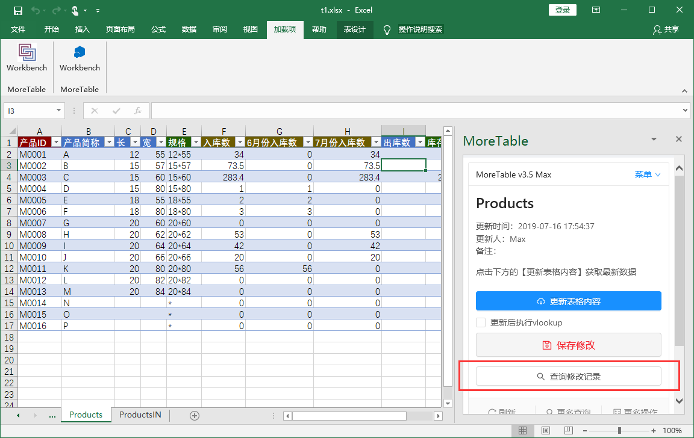
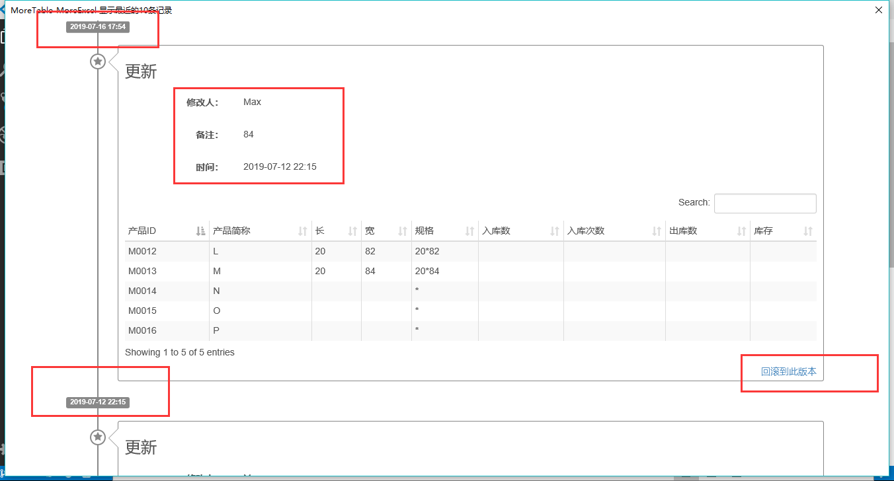

# 查询修改历史

每个表格保存的时候都会留一次记录。包括保存的人，时间，保存的内容。

点击【查询修改记录】，会弹出一个窗口。类似于这个样子

它会按时间先后顺序（最近一次保存记录放在最上面），排列每次修改的内容（也包括删除的内容），包括了修改人，时间，备注（保存修改时填入的）。

### 回滚到以前的状态

MoreExcel能支持把表格回退到从前的状态，这个功能只能在MoreExcel管理平台内执行，普通用户不被允许。
