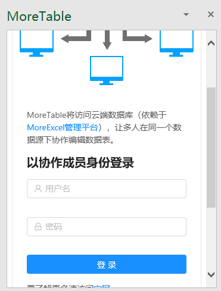
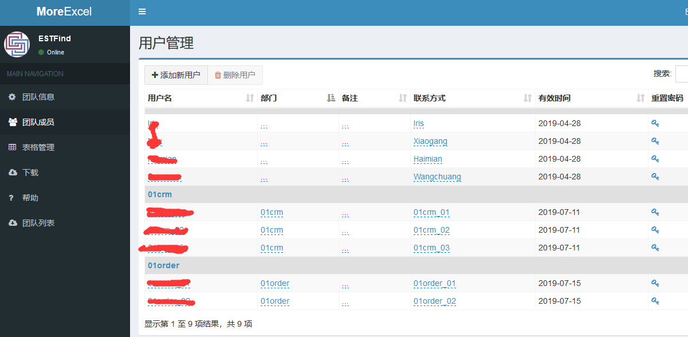

# 打开Excel并登录插件

> 开始之前，请确保安装了MoreTable插件，[安装方式在这里](addin_install)。

现在打开Excel，打开MoreTable插件。如下图显示。

这里的协作者成员账号，来自于MoreExcel管理平台分配的团队成员。这个账号不是自己注册的，而是通过管理员创建并分配的。如果忘记了密码，或者用户名，需要让管理员在MoreExcel管理平台中重置密码。

> 如果忘记了密码，或者用户名，需要让管理员在MoreExcel管理平台中重置密码。

