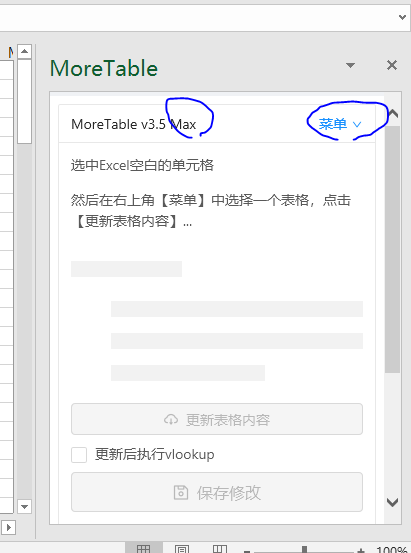
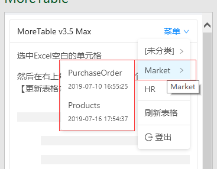
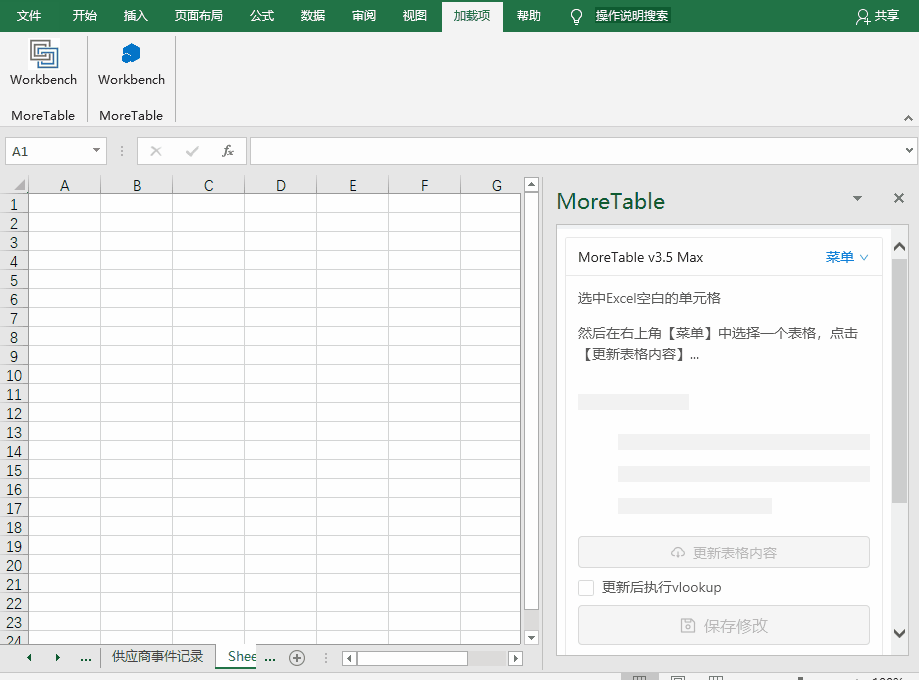
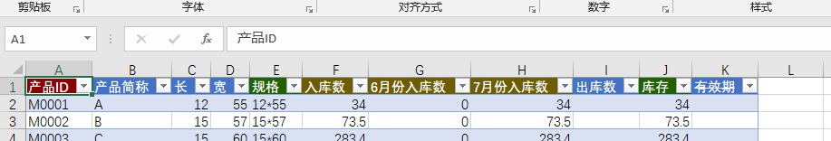

# 更新表格内容

## 登录后的界面

> 只需要一次登录，以后打开插件窗口会自动登录

完成登录后，一般显示如上图，标题上会显示用户名，还有菜单。菜单是常用的功能，鼠标放上去能显示这个用户名相关的表格。相关的表格指的是您有权限浏览的，通过MoreExcel管理平台已经定义好的表格。

### 如果菜单里是空白怎么办？

您需要让MoreExcel管理平台的管理员创建表格定义并分配权限，确保您至少有权限浏览表格。

### 菜单上显示的日期

您注意到每个表格带有日期，也可能没有日期。这个日期代表着上次保存的时间点，可能是您这个用户名保存的，也可能是别人保存的。

## 从菜单中选择一个表格并更新

第一次操作的时候，先从菜单中选择一个表格，然后点【更新表格内容】按钮。这个操作类似于，从MoreExcel管理平台下载表格数据。下面的动画展示这个过程。

由于MoreExcel管理平台的权限控制，有可能：

- **不同的用户登录下，更新的表格样式和内容不同**。比如某些列对某个用户是隐藏的；某些特殊的行，对某些用户是隐藏的。
- **更新的行数有可能只是表格的一部分**。出于性能的考虑，对于那些有数万甚至数十万行的大表格，一次更新只会下载部分（至于下载哪些，可以通过MoreExcel管理平台来控制）。这样，一来提高了Excel性能（打开和编辑不会卡顿），二来避免影响旧数据（方便保护数据）。

## 标准的Excel表格

如上图，您应该发现MoreTable编辑的对象是标准的Excel表格。什么是标准的Excel表格？这是微软Office Excel自带的功能，详细介绍[可参考这里](https://support.office.com/zh-cn/article/excel-%e8%a1%a8%e6%a6%82%e8%bf%b0-7ab0bb7d-3a9e-4b56-a3c9-6c94334e492c?ui=zh-CN&rs=zh-CN&ad=CN)。

标准的Excel表格有这么几个特性：

- 菜单上会显示【表设计】，表格有名称，禁止修改表格名称。
- 没有合并单元格。
- 表头一般带筛选和排序功能。
- 每列的单元格格式是一致的，比如日期列，文字列，数字列，函数列。
- 函数公式仅限于列之间的运算，以及行的汇总（【表设计】菜单可以勾选【汇总行】来显示一个专用的汇总行，在表格底部）。
- 表格是有限范围，表格的右下角有个蓝色的小箭头，拖动可以拉大表格范围。**范围之内的数据才属于本表，范围之外的数据不会被同步**。

## 不同的表头颜色代表不同类型

您应该注意到更新的表格表头有不同的颜色，这可以通过MoreExcel管理平台自定义。这里我们用默认的样式来说明一下。

- 深红色：KEY列。
- 绿色：带函数公式，不需要录入。
- 深黄色：vlookup列，数据来自其它表格的汇总或者相关数据，同样不需要录入。
- 中划线：禁止编辑。
- 普通蓝色：普通的可以人工录入的列。
