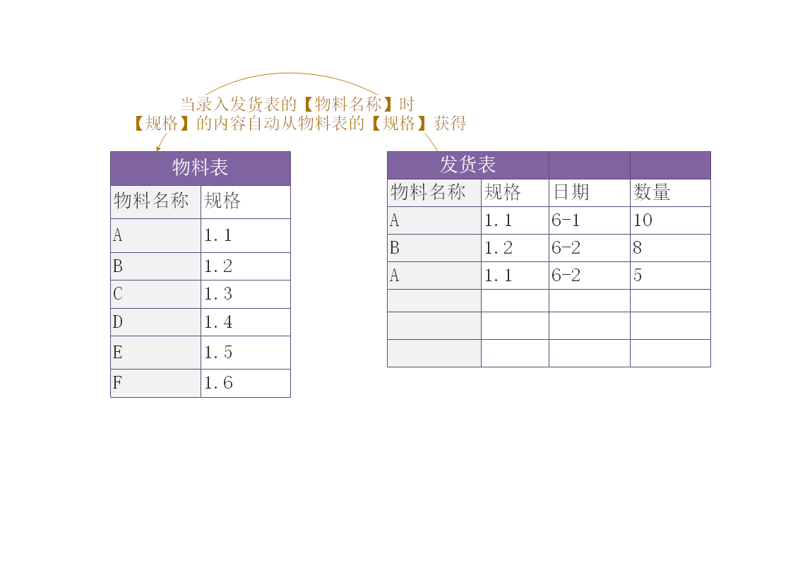
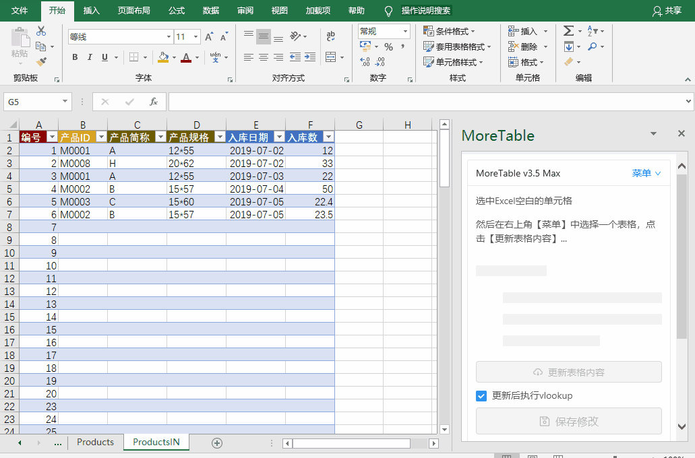
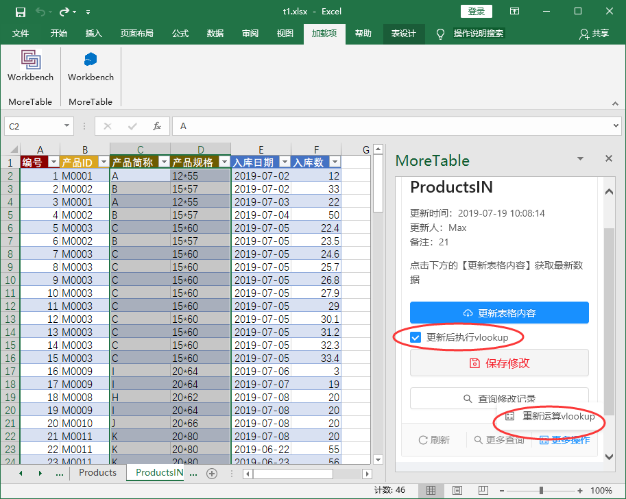
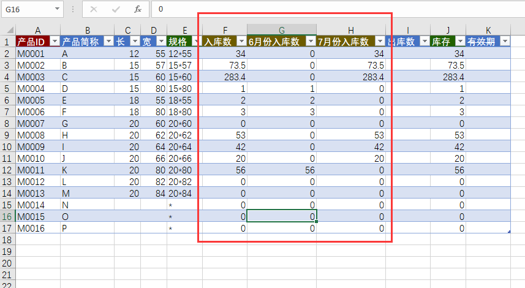

# 辅助编辑利器 -- vlookup跨表借用数据

> 本章节开始涉及跨表的数据借用，在此之前，请先了解一下[处理函数公式的同步](addin_formula)。

## 应用场景

用一个例子来说明

当录入【发货表】的【物料名称】时，自动匹配【物料表】的【物料名称】，把同行的【规格】自动填入【发货表】的【规格】。也就是说，【发货表】录入【物料名称】时，【规格】会自动带出来。乍看下，跟Excel自带的vlookup函数时一致的。实际上MoreExcel管理平台定义的vlookup列也是这样的功能。

一个表格中往往有很多vlookup列，比如录入一个物料名称，可以带出这个物料的很多参数，每一个列代表一个参数，可以设置很多很多列。这样只要录入一个物料名称，会从相关的表格带出很多数据，大大节约录入的时间，还能防错。

## MoreTable的vlookup效果

vlookup列往往和【录入相关】列混合使用，当【录入相关】列录入内容的时候，自动带出【vlookup】列。

如上图，录入【产品ID】的时候，自动带出【产品简称】和【产品规格】。深黄色表头一般代表【vlookup】类型的列。

### vlookup不是公式，是由MoreExcel管理平台定义的

类似于【录入相关】列，【vlookup】不是Excel自带的函数，而是由MoreExcel管理平台定义好的，由后台程序计算出来的。

### 避免人工录入

vlookup的运算是由MoreExcel管理平台定义好的。应当避免人工录入。

### 重新运算vlookup

有时候vlookup不会自动执行，您可以手工刷新一次，让表格中所有的vlookup重新运算一遍。您可以在更新表格内容后执行这个动作，或者粘贴一批数据之后执行，这两种场景最常见。

如上图，您有两个地方可以重新运算vlookup

- 【更新表格内容】后执行重新运算vlookup
- 点击【重新执行vlookup】按钮

## vlookup用于复杂统计

前面的例子是最常见的录入时带出相关信息，这是一种最简单的取值方式。

vlookup还能支持一些比较复杂的统计方式。我们来看下面的例子。

【入库数】【6月份入库数】【7月份入库数】这三个列是vlookup。入库数明显是合计出来的，而不是简单的从入库表中取个现有的值。入库数来自于入库表的相关产品ID的入库数合计。而6月份入库数则更加厉害，限制只有6月份的产品ID的入库数合计。这些功能都是从MoreExcel管理平台定义的。
