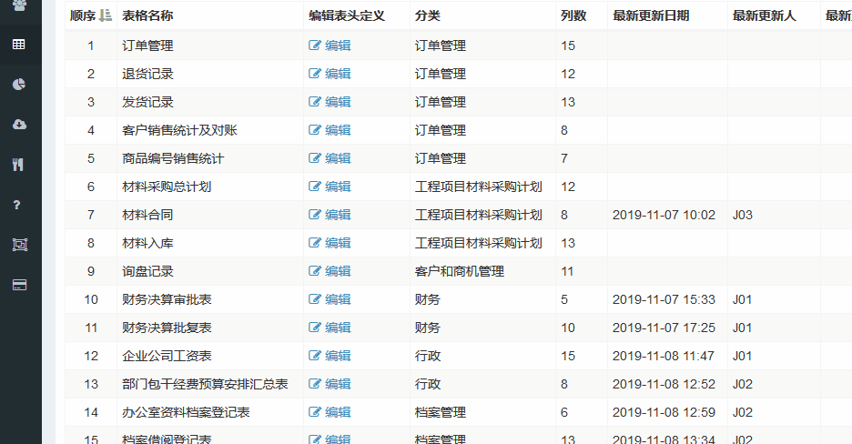

## 给表格分类

当创建了很多很多表格定义之后，迫切需要做表格整理。MoreExcel可以定义表格的分类（如下图所示），通过定义分类，排序等方式，**可以让Excel插件上呈现折叠效果的菜单，便于管理**。

如果按照上图方式，你可以在Excel上看到如下的菜单效果。

### 多层折叠菜单效果

有时候咱们还需要进一步分类，做出多层折叠的菜单效果。可以这么做。

用“--”（两个中划线）隔开，写第二级分类。如上图所示。

“质检部”作为第二级分类，显示在第二级菜单中。MoreExcel对层级数量没有限制，可以任意分类。

## 拖动并排序

一开始创建表格定义的时候，也许是随心所欲。之后表格列表上看起来比较乱。你除了可以通过分类表格外，还可以拖动它们，排列顺序，这样看起来更整齐。

