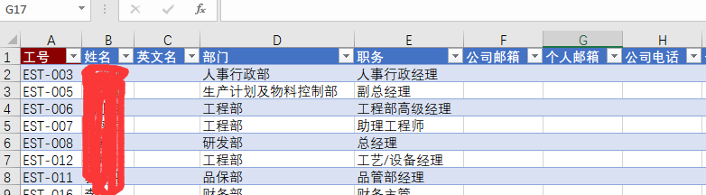
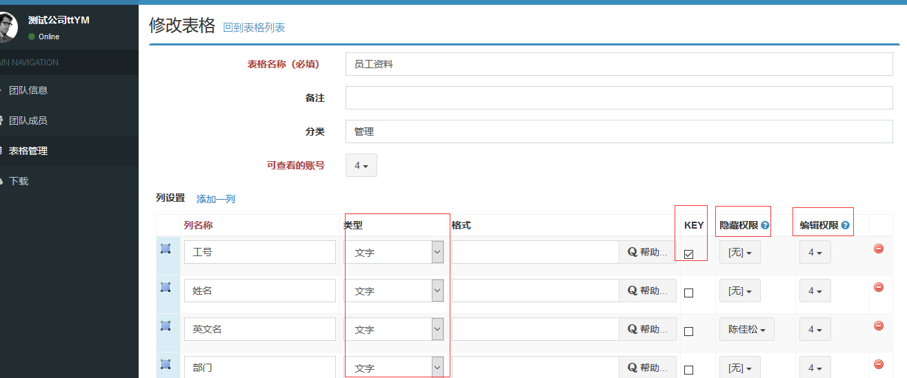
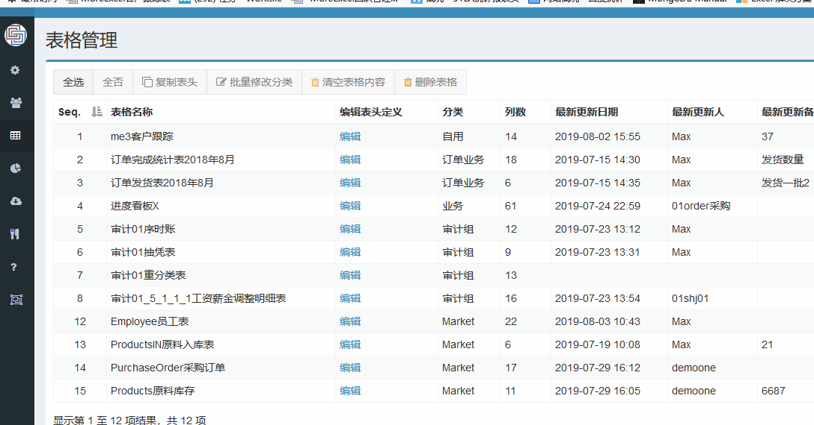

# 定义第一份表格

## 什么是Excel表格

> 拿员工资料表来举例。

 
**在Excel软件中，我们使用“表格”功能**。Excel表是一个非常实用且高效的功能，如果你还不清楚，可以参看[这篇文章](https://support.office.com/zh-cn/article/excel-%e8%a1%a8%e6%a6%82%e8%bf%b0-7ab0bb7d-3a9e-4b56-a3c9-6c94334e492c?ui=zh-CN&rs=zh-CN&ad=CN)。
我们需要在这种“标准”的表格下进行操作。标准的定义是：有表头，每列的格式是一致的，或日期或函数或文字等等，没有合并单元格。

## MoreExcel的协作原理

传统的文件共享是用网上邻居，相当于把excel文件保存在网盘上。传统的方式无法做到同时协同。MoreExcel将Excel表格内容保存到管理平台，管理平台实际上是数据库。所以你需要在管理平台定义一个或多个“数据库”。“数据库”就是这里的Excel表格。

## 开始定义表格

明白了上面那些基本知识之后，再来看管理系统的表格定义。

 
最顶部，写好表格名称，写一个分类。

下面是列的定义，每一行代表一个列的定义，包括了：名称，类型，格式，KEY，隐藏权限和编辑权限。第一次做“员工资料”表的时候，我们把列名填入，然后有几个非常重要的事情要做。

- 确认哪一列是KEY（否则无法保存表格定义），也就是图示上的KEY，找某一列打勾即可。如图我们挑选了工号当KEY。
- 分配【可查看的账号】。在表格名称下面，有红色的【可查看的账号】。它的意思是，这个表可以被谁看到，一开始还没有选择，任何团队成员都不能看这个表，不能查看也就不能编辑，如果这里不勾选，Excel上是找不到这个表格的。
- 分配【编辑权限】。一定要给列分配一些编辑权限，否则团队成员是不能保存内容的。

定义好表格样式后，点击最底部的保存按钮，完成定义。

### KEY列

定义表格之前，我们需要把其中一列当成KEY。如果你懂一点数据库的知识，KEY是一行的唯一标识，KEY是不能重复的。比如可以把工号，日期，单号，序列号之类的作为KEY，也可以用最简单的数字递增当KEY。

> KEY列的最主要作用，是增行和删行，表格的一行，只有KEY列有内容才算新增。所以可以通过限制KEY列的编辑权限来控制什么用户能增行和删行。

## 快速复制定义

有些表格的定义大同小异，就能使用【批量复制表头】。

这个方式适用于：**表格定义相同或类似，只是名字不一样**。
