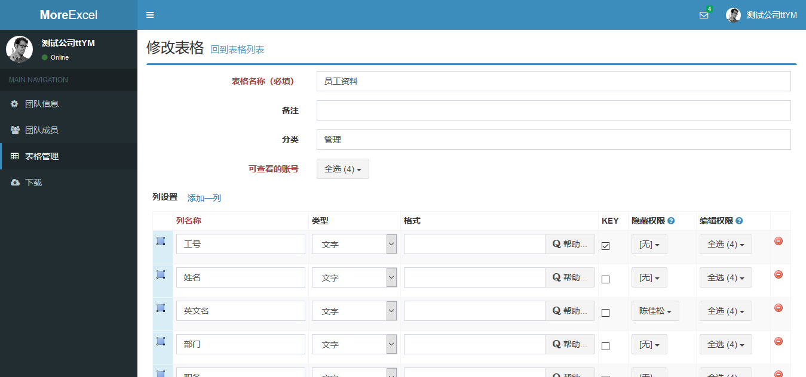
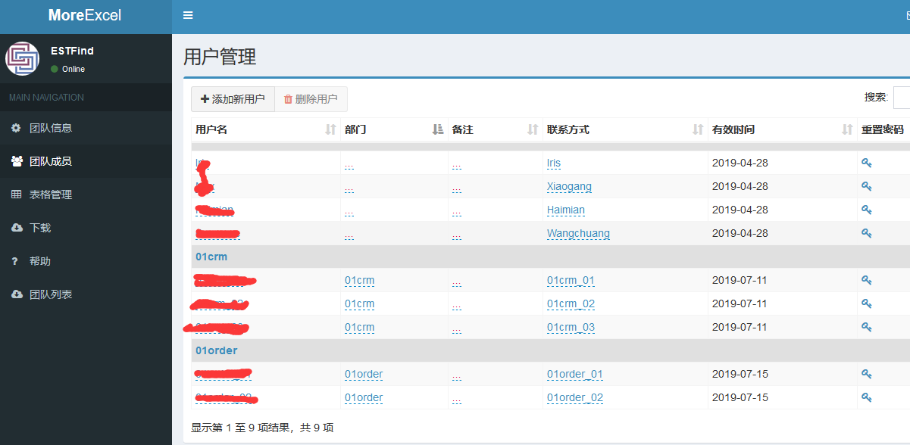
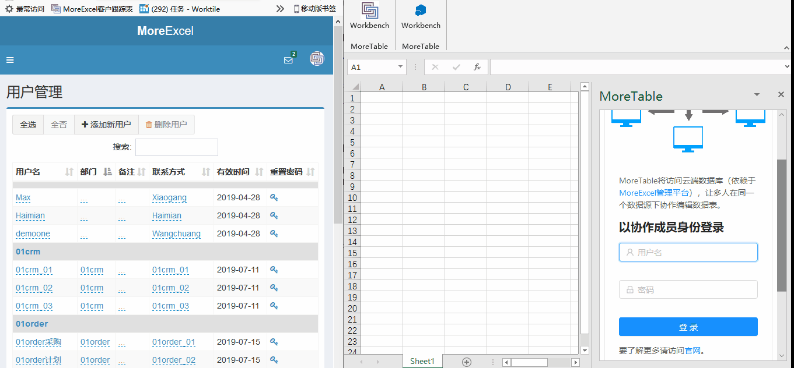

# 创建管理团队和若干成员

> 假设您是个管理员

打开MoreExcel管理平台
[https://me3.6erp.cn/admin/](https://me3.6erp.cn/admin/)
 
跟常规的注册方式一样，你需要提供一个手机号码和用于短信验证的验证码。MoreExcel管理平台没有使用用户名和密码登录，而使用动态验证码登录。一个手机号可创建一个团队。如果登录的时候发现是新手机号，则需要录入一些基本的团队信息：

- 团队名称
- 联系方式

团队相当于一个公司，一个管理员去管理很多员工，很多表格。不同团队之间的员工信息和表格是隔绝的。

登录进去之后，左侧是菜单栏

菜单栏包括：

- 团队信息
- 团队成员
- 表格管理

之前我们讲过管理员。管理员就是用手机号和动态验证码等了这个管理系统，这就是管理员的指责。**那么菜单中的“团队成员”，就是平时用Excel的那批人了**。

## 一个管理员和若干个协作者账号

> 团队成员是用来登录Excel的。

给你的团队添加一批用户，然后把用户分配给每个协作者。

添加用户的时候，会赋予一个初始的登录密码。注意，这里的团队成员用Excel的时候也是需要登录的，用的是这里设置的用户名和密码。

注意区别：

- 管理员用手机号登录管理系统。
- 实际操作的人用管理员分配的用户名和密码登录Excel。
