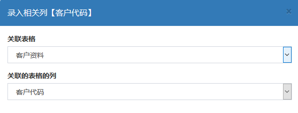

录入相关，就是这一列的内容一定来自于其它表格中的数据。比如输入项目编号，客户名称，员工工号等，这些信息往往存储在别的表格中。这个类型的录入内容一定要来自指定的地方，否则共享会出错。

一般它会和[vlookup类型](group_table_col_vlookup)配合使用。

## 格式写法

【录入相关】可以理解为autocomplete，类似于选择，类似于百度搜索框的效果，选择项是来自于其它表格的某列内容。比如我们要录入客户代码，由于不好记忆，我们还设立了一张客户资料表。录入客户代码的时候自动提示客户资料表中的代码列。【录入相关】的格式写法类似于vlookup。

## 例子

## 解释

由于Excel软件本身不支持一边录入一边提示的效果。我们把录入框做到了插件页面上面。如上图，当选择【录入相关】列的单元格时，右侧自动跳出录入框，在右侧录入，一边录入一边提示（类似于百度搜索框的效果），可以在下拉列表中选择，选择完毕后自动录入excel的单元格。