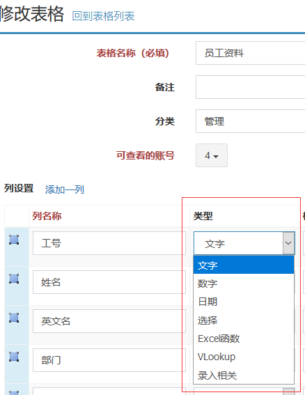
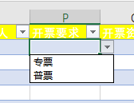
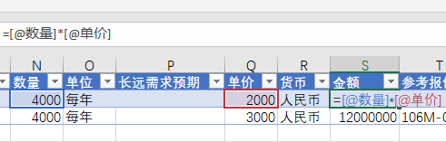
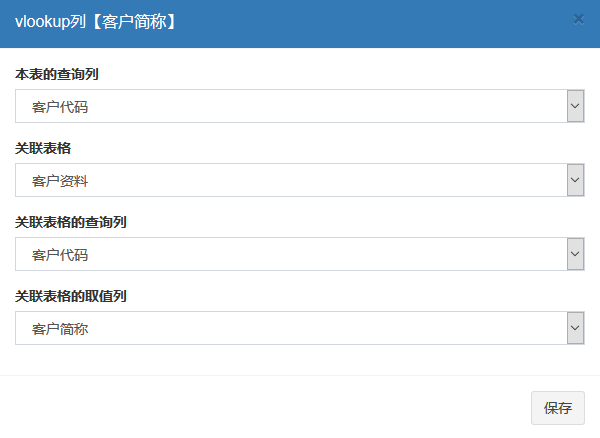
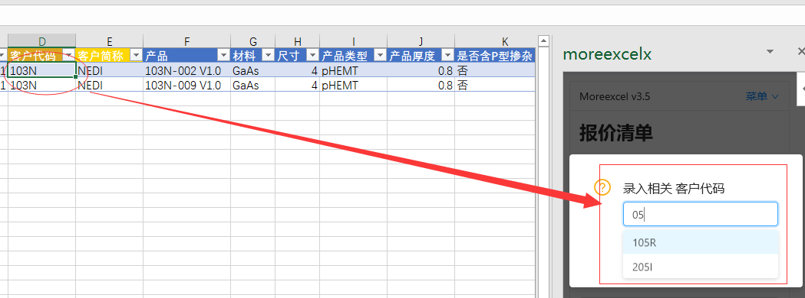

# 定义列的类型

定义表格的时候，每个列可以指定一个类型。

 
每个列必须指定一个类型，文字，数字，日期都比较好理解，对应于Excel单元格格式，文字，数字，日期。“选择”类型是有个下拉框可以做固定选择的；Excel函数就是咱们熟知的excel公式，它只能做列之间的运算；vlookup是专门用来跨表查询录入的；录入相关和选择有些类似，只是选择内容来自其它表格，而且有录入提示的效果。

我们还注意到，类型选择后面还有一个格式，格式列可以录入一些类型相关的格式写法，具体见下表。

## 列类型：日期

| 格式写法 | [请参照Excel单元格格式：日期类型](https://support.office.com/zh-cn/article/%e6%8c%89%e6%83%b3%e8%a6%81%e7%9a%84%e6%96%b9%e5%bc%8f%e8%ae%be%e7%bd%ae%e6%97%a5%e6%9c%9f%e6%a0%bc%e5%bc%8f-8e10019e-d5d8-47a1-ba95-db95123d273e?ui=zh-CN&rs=zh-CN&ad=CN) |
| --- | --- |
| 例子 |  | 
| 效果 |（略） |

## 列类型：数字

| 格式写法 | [请参照Excel单元格格式：数字](https://support.office.com/zh-cn/article/%E6%95%B0%E5%AD%97%E6%A0%BC%E5%BC%8F%E4%BB%A3%E7%A0%81-5026bbd6-04bc-48cd-bf33-80f18b4eae68) |
| --- | --- |
| 例子 |  | 
| 效果 | （略） |

## 列类型：选择

| 格式写法 | 用英文逗号分开，多选一 |
| --- | --- |
| 例子 |  | 
| 效果 |  注意，选择类型是多选一，Excel本身不支持多选，如果需要多选，请使用文字类型，自己录入 | 

## 列类型：Excel函数

| 格式写法 | 除了跨表的vlookup之外，支持绝大多数的Excel公式，只能进行列之间的运算。[请参考这个链接](https://support.office.com/zh-cn/article/%E4%BD%BF%E7%94%A8-excel-%E8%A1%A8%E6%A0%BC%E4%B8%AD%E7%9A%84%E8%AE%A1%E7%AE%97%E5%88%97-873fbac6-7110-4300-8f6f-aafa2ea11ce8) | 
| --- | --- |
| 例子 |  | 
| 效果 |  |
 
## 列类型：vlookup

| 格式写法 | 点击格式栏的右侧【帮助】按钮，在打开的对话框中，选择四项内容，分别是：【本表的查询列】 【关联表格】 【关联表格的查询列】 【关联表格的取值列】。意思是，当【本表的查询列】录入一个内容之后，查询【关联表格】的【关联表格的查询列】，匹配到内容后把同行的【关联表格的取值列】的内容，填入本列。如果有点晕，就参照一下excel标准vlookup函数的写法。 |
| --- | --- |
| 例子 |  |
 
## 列类型：录入相关

| 格式写法 | 【录入相关】可以理解为autocomplete，类似于选择，类似于百度搜索框的效果，选择项是来自于其它表格的某列内容。比如我们要录入客户代码，由于不好记忆，我们还设立了一张客户资料表。录入客户代码的时候自动提示客户资料表中的代码列。【录入相关】的格式写法类似于vlookup。 |
| --- | --- |
| 例子 |  |
| 效果 | 由于Excel软件本身不支持一边录入一边提示的效果。我们把录入框做到了插件页面上面。如上图，当选择【录入相关】列的单元格时，右侧自动跳出录入框，在右侧录入，一边录入一边提示（类似于百度搜索框的效果），可以在下拉列表中选择，选择完毕后自动录入excel的单元格。 |

## 跨表数据引用：活用【录入相关】类型和【vlookup】类型组合

【录入相关】类型和【vlookup】类型是非常常用的组合。拿前面的【客户代码】和【客户简称】为例。【客户代码】列用【录入相关】类型；【客户简称】列用【vlookup】类型。

 
当【客户代码】列录入内容的时候，首先查找【客户资料】表的【客户代码】列，保证录入内容不错，当完成【客户代码】录入完成的时候，同时查找【客户资料】表中的【客户代码】列，把同列的【客户简称】放到本表的【客户简称】单元格中。

建议前面这段话多读几遍。

这样就能达成这样的效果：录入客户代码的时候同时带出客户简称。客户代码和客户简称都是引用了客户资料表格中的数据，保证了数据一致性。

当然，我们还能设计更复杂一些，比如一个【录入相关】，带出很多个【vlookup】；甚至带出一个【vlookup】的时候，同时引出其它【vlookup】。可以无限引用下去。

