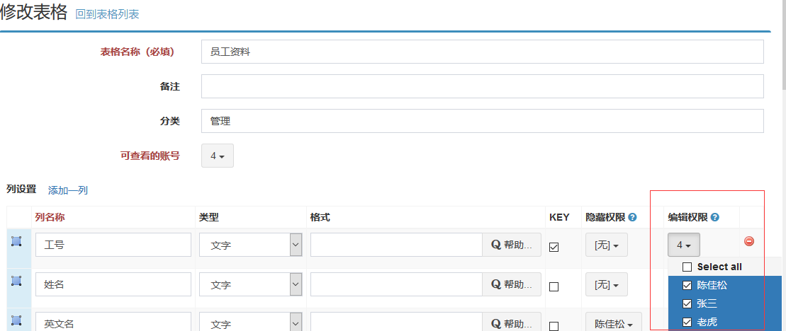
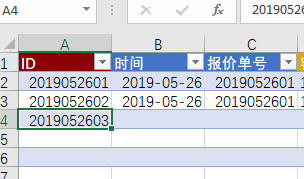

# 编辑权限

编辑权限，就是可以保存到数据库中的权限。在Excel表格中编辑单元格，并保存到数据库中。

MoreExcel的编辑权限是针对行的。
 

可编辑的前提是：先要有浏览权限，即【可查看的账号】要有分配；然后不能有【隐藏权限】；最后分配了【编辑权限】。

## 阻止用户加行和减行

加行和减行是编辑权限的一种，需要依靠【KEY】列的编辑权限分配。【KEY】列，也就是数据库中的ID，定义表格样式的时候，必须要指定一列是【KEY】列，比如序号，工号。【KEY】列的内容要唯一性，不能重复，这样才能有效地标识一行。

**Excel常见地添加一行，就是【KEY】列添加内容，减行也是如此。** 如果在其它单元格内录入内容，而【KEY】列是空白，则没有成功保存，那些单元格的内容不被承认，会被数据库抛弃。

 
如图所示，ID是【KEY】列，用大红色标识，写入新行的时候，先录入ID，这一行就相当于新增的，保存数据库的时候会新增一列。

**当然，前提是【KEY】列必须分配了编辑权限，否则保存数据库的时候会被阻止，意味着不能加行，也不能减行。**
