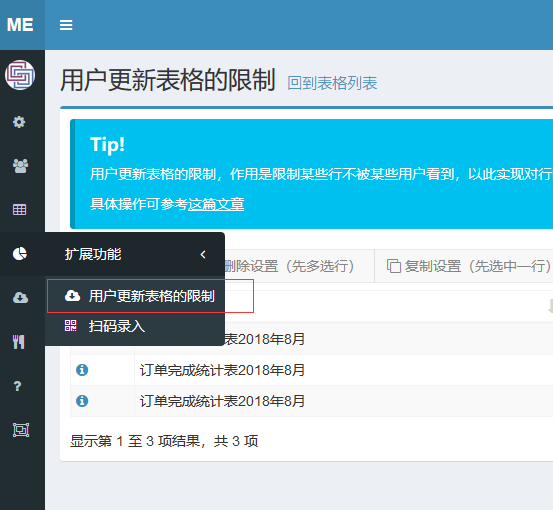
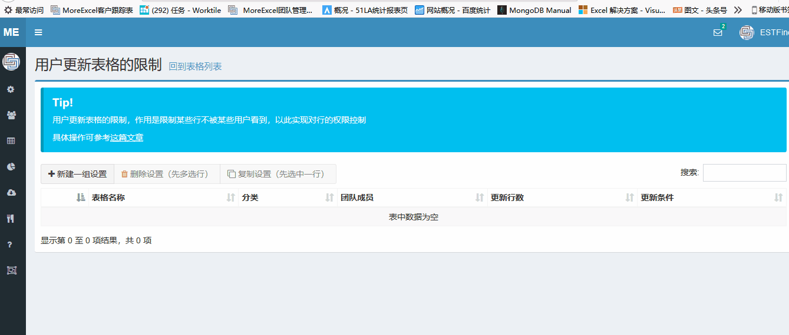
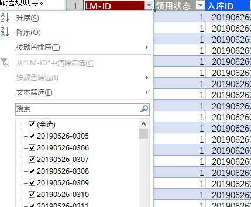

# 控制行的浏览和编辑权限

前面讲的都是列的浏览和编辑权限，MoreExcel还能控制行的浏览和编辑权限。只有管理员才能分配权限。

## 应用场景

不同的员工去看不同的行。比如说订单跟踪表格，其中有一列是业务员。每个业务员有自己的账号，我们希望他们用自己的账号登录时，只能看到自己所属的订单，看不到别人的订单。

## 如何去设置
 
来到【用户更新表格的限制】页面。这是MoreExcel的一个扩展功能。每次Excel从管理平台更新表格内容的时候，并不会取得所有的内容。MoreExcel管理平台可以给用户设置一些更新的条件，比如行数，筛选规则等。

如上图案例。设置一个表格对多个用户的规则，用户【01crm_01】代表业务员A，当这个用户去更新表格内容的时候，MoreExcel管理平台只会把业务员这列内容等于A的行读取下来。这样【01crm_01】用户只能看到业务员A相关的订单。其它用户同理。

## 和Excel的筛选有什么区别

这个功能和Excel的筛选看上去差不多。

Excel的筛选功能并不能彻底隐藏，用户还是有能力看到的。而MoreExcel管理平台的权限功能，从数据库角度出发，只下载对应的内容给用户（普通用户还没有权限决定能看到什么），这样的权限控制是严格而彻底的。

# 几个常见的应用场景

## 不同的人编辑他负责的行

比如说业务员跟单表，可以设置一列业务员的名字或者客户代号，然后在【浏览选项】中把业务员的名字或者客户代号跟用户名关联起来。

## 过期不可编辑

为了防止篡改历史纪录，我们可以给一列时间，比如按月份的，编辑者只能编辑当月的内容，而过去的月份则不能被编辑。

## 海量数据存储

如果表格的内容日积月累之下非常多，通常超过一万行，甚至十几万行，会造成excel文件非常的大，打开和保存都非常卡顿。这种情况非常适合于限制行的浏览，比如一次性只浏览300行（为保证效率不超过5000行），同时配合其它的浏览选项，一次性只处理一部分数据（实际上咱们每次也只编辑一小部分内容），让其余大量的数据存放在数据库中，可以大大加快excel软件的运行效率。
