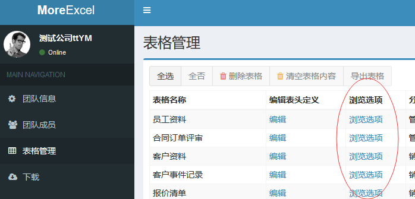
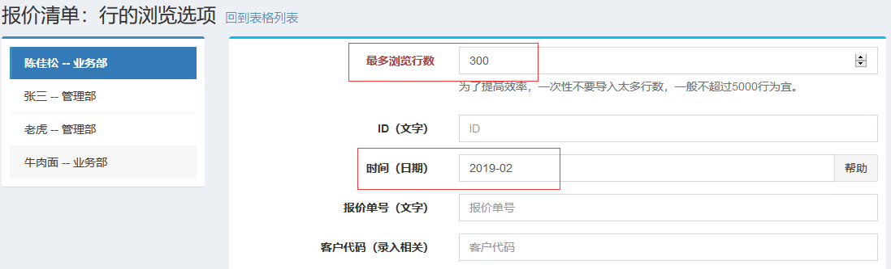

# 控制行的浏览和编辑权限

前面讲的都是列的浏览和编辑权限，MoreExcel还能控制行的浏览和编辑权限。只有管理员才能分配权限。

 
如图，点击表格编辑右侧的【浏览选项】

 
打开这个对话框，根据前面的表格定义，他有若干个可以浏览的用户（显示在左侧），每个用户都可以定义浏览哪些内容。比如上面的图示，这个用户有两个浏览限制：最多浏览行数300行，时间2019-02。意思是，先把报价日期填写的2019-02（也就是二月份）的内容，抽出最多的300行内容显示在Excel表格中，这个用户只能编辑这部分内容。
行的编辑权限有几个常见的应用场景

## 不同的人编辑他负责的行

比如说业务员跟单表，可以设置一列业务员的名字或者客户代号，然后在【浏览选项】中把业务员的名字或者客户代号跟用户名关联起来。

## 过期不可编辑

为了防止篡改历史纪录，我们可以给一列时间，比如按月份的，编辑者只能编辑当月的内容，而过去的月份则不能被编辑。

## 海量数据存储

如果表格的内容日积月累之下非常多，通常超过一万行，甚至十几万行，会造成excel文件非常的大，打开和保存都非常卡顿。这种情况非常适合于限制行的浏览，比如一次性只浏览300行（为保证效率不超过5000行），同时配合其它的浏览选项，一次性只处理一部分数据（实际上咱们每次也只编辑一小部分内容），让其余大量的数据存放在数据库中，可以大大加快excel软件的运行效率。
