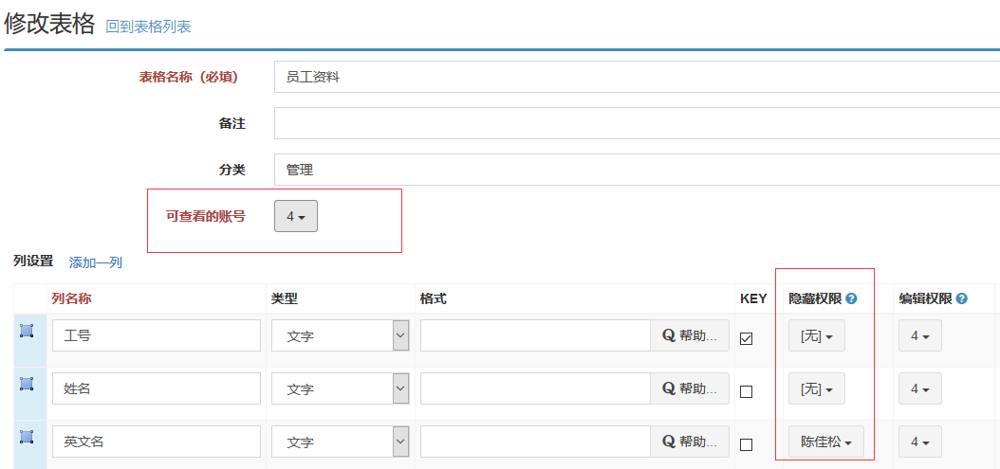

# 浏览权限

浏览权限，就是能看不能保存。常用于管理者去查看表格，不编辑表格。MoreExcel需要在表格定义的时候管理浏览权限。

 
MoreExcel需要设置两个地方：顶部的【可查看的账号】和每个列的【隐藏权限】。【可查看的账号】是针对全表的，我们需要先勾选一部分用户，这些用户才能看到这个表格，否则插件上不会显示这个表格。用列的【隐藏权限】可以控制某些用户看不到这列，如果不勾选的话，这列会显示在Excel中，勾选的话就看不到了。
如果这个用户能看到表格，要勾选【可查看的账号】，而不要勾选【隐藏权限】。
