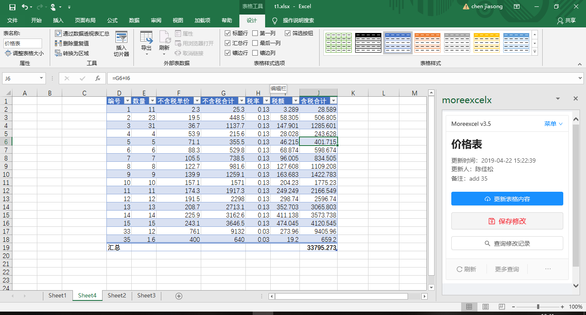

# MoreTable_readme

MoreExcel是一个用于表格协作的软件系统。在统一的管理平台下定义表格样式和权限，然后以Excel为界面，浏览和更新表格。我们平时习惯于Excel。MoreExcel是嫁接在Excel软件之上的插件系统，帮助多个人来共同编辑表格。MoreExcel会赋予表格编辑更多的控制功能，比如：

- 行和列的编辑权限，隐藏功能。
- 防错功能，能一定限度地防止破坏公式，破坏旧数据的行为。
- 追查记录，能保留编辑记录。
- 回滚从前的状态，退回到历史记录中的某个时间点。
- 优雅地解决海量数据的问题。比如保存数万及数十万行的数据，Excel并不会卡顿。
- 集成扫码录入。
