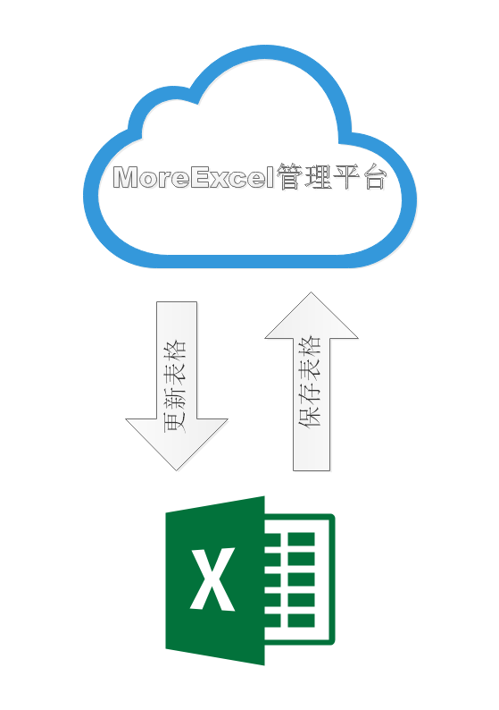

# MoreTable是什么

## MoreTable是一个用于表格协作的软件系统

MoreTable将访问云端数据库，让多人在同一个数据源下协作编辑数据表。MoreTable依赖于一个[MoreExcel管理平台](https://me3.6erp.cn/admin/)下定义表格样式和权限，然后以Excel为界面，浏览和更新表格。

如上图所示，这套系统分成两部分，一个是MoreExcel管理平台，另一个是MoreTable插件。

- [MoreExcel管理平台](https://me3.6erp.cn/mex/admin/home/)
- [MoreTable插件下载](https://appsource.microsoft.com/zh-cn/product/office/WA200000158?tab=Overview)

管理员登录MoreExcel管理平台，定义表格样式，表格关系，划分权限等。员工使用Excel插件（安装在Excel软件内）来更新表格，修改表格，保存表格。

## MoreTable功能点

MoreTable以Excel为界面操作共同编辑数据表。相比于传统的ERP系统，它自我定义表格样式，操作习惯更符合传统；同时，它会赋予Excel更多的控制功能，比如：

- 行和列的编辑权限，隐藏功能。
- 各种快速辅助录入方式。
- 录入防错，防止破坏公式，防止破坏表格样式。
- 追查记录，能保留编辑记录。
- 回滚从前的状态，退回到历史记录中的某个时间点。
- 优雅地解决海量数据的问题。比如保存数万及数十万行的数据，Excel并不会卡顿。
- 集成扫码录入。

## 和其它Excel协作解决方案的比较

| | 共享文件夹 | 腾讯文档等网络Excel | 网盘或SVN | MoreTable |
| --- | --- | --- | --- | --- | 
| 共享者的范围 | 局域网范围 | 互联网范围，不能支持需要保密的局域网范围 | 局域网和互联网范围都能支持 | 局域网和互联网范围都能支持 |
| 安全性 | 容易丢 | 安全高 | 安全高 | 安全高 | 
| 权限控制的颗粒度 | 一个文件一个密码 | 一个sheet一个密码 | 一个文件一个密码 | 可对表格的某些行列设置隐藏和编辑权限 |
| Excel使用体验 | 原生态Excel | 模拟Excel的网页版软件，使用习惯上有点偏差 | 原生态Excel | 原生态Excel |
| 防错策略 | 不能防错 | 可以做表格回滚 | 可以在文件级别回滚 | 可以做表格回滚 |
| 扩展功能支持 | 无 | 无 | 无 | 集成扫码录入 |
| 协作方式 | 把文件放在共享文件夹，同时只能一人编辑 | 保存在数据库中，可以同时编辑 | 通过文件级别的上传下载 | 保存在数据库中，可以同时编辑 |

---

目录

- [MoreTable能解决什么](index_solv)
- [和传统管理软件的区别](index_diff)
- [和旧版MoreExcel2的区别](index_diff2)
- [从一个例子开始](GettingStarted)
- MoreTable插件
  - [Excel中安装插件及常见安装问题](addin_install)
  - [打开Excel并登录插件](addin_start)
  - [查看表格](addin_update)
  - [处理函数公式的同步](addin_formula)
  - [辅助编辑利器 -- 录入相关](addin_autocomplete)
  - [辅助编辑利器 -- vlookup跨表借用数据](addin_vlookup)
  - 辅助编辑利器 -- 扫码录入
  - [处理增删行列](addin_colrow)
  - 修改并保存表格
  - [查询修改历史](addin_history)
  - 接入电子看板
  - 接入手机端，通过手机端查看
- MoreExcel管理平台
  - [创建一个团队](group_new)
  - 定义协作者并分配登录账号
  - [定义表格](group_def_table)
  - [定义表格的列类型](group_table_col_def)
  - [分配列的浏览权限](group_table_view_rights)
  - [分配列的编辑权限](group_table_edit_rights)
  - [控制行的浏览和编辑权限](group_table_row_rights)
  - 定义表头样式
  - 设计多表之间的数据借用和关系
- 应用案例
  - [【库存表和入库表】，并按月份统计入库量和统计库存](samples/s1)
