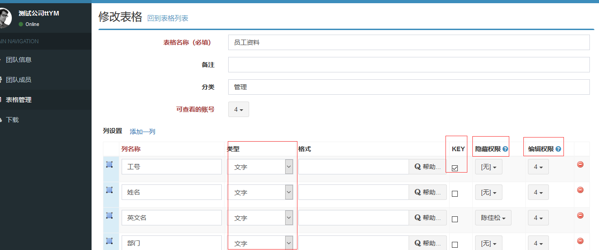

# 和传统管理软件的区别

传统的管理软件，比如ERP，OA，MES等，本质上是表格存储和运算，跟Excel表格没有本质区别。当然，Excel本身的缺陷，比如没有管控，修改随意，不好管理等，正好就是管理系统擅长的领域；同样的，管理软件的缺点也很明显，比如缺乏灵活性。随着企业的发展，对表格的增删改非常频繁，而ERP一般把数据表定义，关系，运算做死。管理软件不能跟随企业的变化而变化，时间长了便容易丧失其价值。

**MoreExcel允许用户自己定义和修改表格样式，在此基础上做表格协作，兼具了管理软件的严谨，和Excel的灵活。**

## 通过MoreExcel管理平台定义表格

通过MoreExcel管理平台定义表格，好比自建数据库，包括表格的每个列的类型，列之间的函数公式，表格之间的数据引用等。

## Excel以此为数据源

MoreExcel管理平台是Excel操作的数据源。

## 和其它Excel协作解决方案的比较

| | 共享文件夹 | 腾讯文档等网络Excel | 网盘或SVN | MoreTable |
| --- | --- | --- | --- | --- | 
| 共享者的范围 | 局域网范围 | 互联网范围，不能支持需要保密的局域网范围 | 局域网和互联网范围都能支持 | 局域网和互联网范围都能支持 |
| 安全性 | 容易丢 | 安全高 | 安全高 | 安全高 | 
| 权限控制的颗粒度 | 一个文件一个密码 | 一个sheet一个密码 | 一个文件一个密码 | 可对表格的某些行列设置隐藏和编辑权限 |
| Excel使用体验 | 原生态Excel | 模拟Excel的网页版软件，使用习惯上有点偏差 | 原生态Excel | 原生态Excel |
| 防错策略 | 不能防错 | 可以做表格回滚 | 可以在文件级别回滚 | 可以做表格回滚 |
| 扩展功能支持 | 无 | 无 | 无 | 集成扫码录入 |
| 协作方式 | 把文件放在共享文件夹，同时只能一人编辑 | 保存在数据库中，可以同时编辑 | 通过文件级别的上传下载 | 保存在数据库中，可以同时编辑 |
