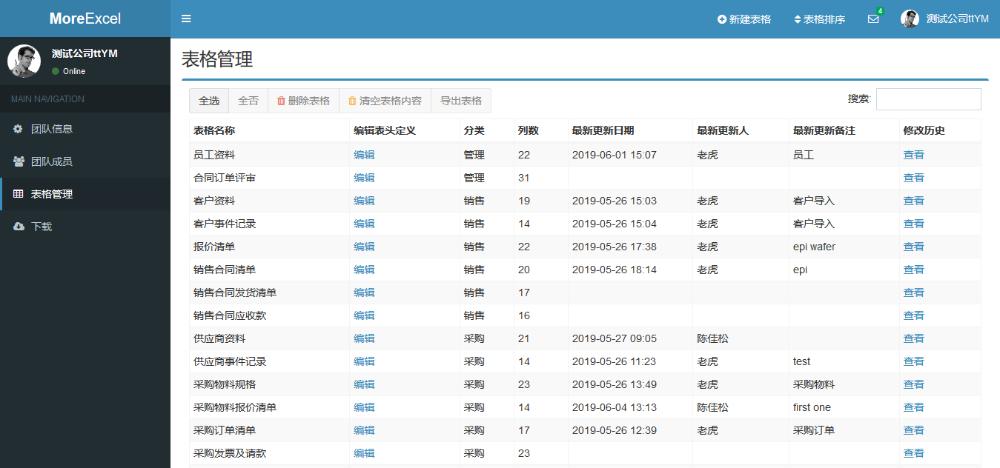

# MoreTable要解决什么问题

传统的管理软件，比如ERP，OA，CRM，PLM，MES等等这些常见的管理系统，本质上是维护N多个表格，比如说订单表，生产表，员工表等等，还有那种用算法生成出来的统计表（比如生产日报表）。说起表格，Excel是应用最广泛的。Excel和管理软件比起来，各有缺点。

- 管理软件比较死板，改起来费事。
- Excel太过灵活，不容易管控，也不方便协同。

**MoreTable介于两者之间。**

MoreTable可以让管理员自己定义表格，表格名称，列，编辑权限，查看权限；自己定义函数，定义表格之间的关系。同时，MoreTable是嫁接在Excel之上的插件，用起来仍然跟Excel一样，包括公式函数。

---

我们列几个常见的应用案例

## DIY ERP

MoreTable所编辑的表格，来自于[MoreExcel管理平台](https://me3.6erp.cn/mex/admin/home/)。通过MoreExcel管理平台，您可以定义各种表格，表格之间还能通过vlookup连接在一起，本质上，这就是一套自己管理的ERP系统。

## 一个表格，多人协作

有时候，我们并不需要ERP那么复杂的系统。MoreTable可以作为大系统的补充，实现一些个性化的管理流程。比如售后跟踪表，项目经理录入发货的产品资料，仓库人员负责录入对应的发货信息（日期，单号什么的），售后人员记录定期的维护信息。

多个用户协作编辑表格，可以通过[MoreExcel管理平台](https://me3.6erp.cn/mex/admin/home/)来定义。

## 解决海量数据下的文件卡顿

Excel文件日积月累之下，会变得很大，平时打开文件会卡顿，编辑还容易崩溃。MoreTable将表格保存在数据库中，平时只需要读取一部分（比如几百行甚至数千行）进行编辑，这样总比保存十几万行快。

另外，通过控制用户的查看权限，MoreTable还能限制这个用户只能读取表格的一部分，甚至只能查看少数表格，这样一个文件内的数据会变的非常少。这样文件体积也会小很多。
