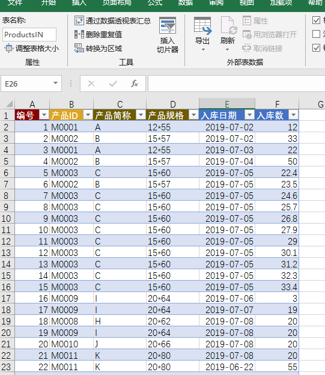

# 【库存表和入库表】，并按月份统计入库量和统计库存

## 目标：按月统计发货量

类似于进销存的仓管管理模块。先准备两个表格

Products 库存表

ProductsIN 入库表

如上图，产品ID（也能用产品的名称），产品简称，规格，长，宽等，属于产品的信息和参数。这里面有两种对应关系。

- ProductsIN入库表的产品ID来自于Products库存表，它们可以做个对应关系。
- ProductsIN入库表的【入库数】，会合计到Products库存表的【入库数】，【6月份入库数】，【7月份入库数】
- 同时，Products库存表还包含了一个公式，【库存】=【入库数】-【出库数】。（以后会讲到如何做入库和出库的统计）

MoreExcel的能力，就是将ProductsIN入库表的【入库数】自动合计到Products库存表的【入库数】，【6月份入库数】，【7月份入库数】内。同时，还能通过划分权限来限制员工的行为，比如库管只能修改ProductsIN入库表，管理者能看到Products库存表。

## 如何在MoreExcel管理后台中定义这两份表格

这里复杂的地方是统计月份入库数。比如M0011这个产品ID在6月份的入库数，需要找到ProductsIN入库表中，这个产品在6月份的入库数合计。

后台需要这么定义

这里需要用到列的[vlookup类型](../group_table_col_def)。