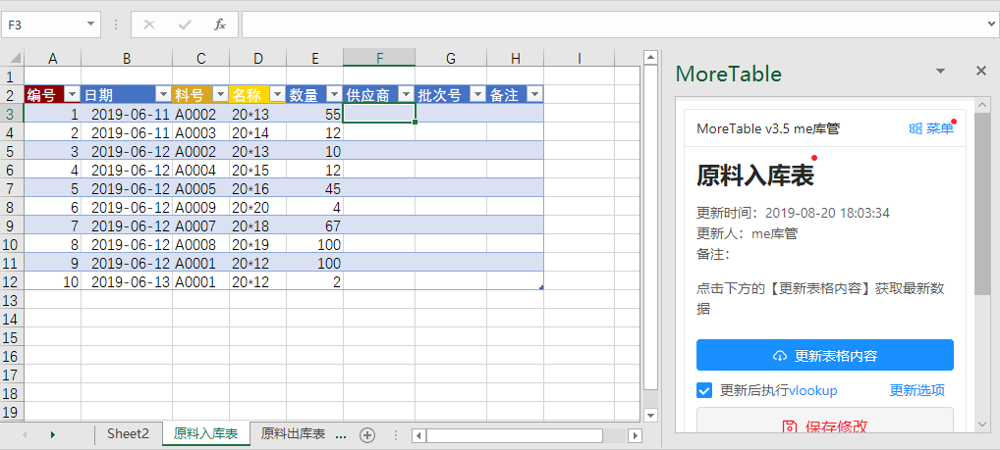

# 进销存 -- 原料出入库和库存统计

这个模块由三个表格组成：
- 原料入库表
- 原料出库表
- 原料库存统计表

> 企业里除了原料，还有成品，半成品，工具等，依葫芦画瓢建三个类似的表即可。

有两个moreexcel用户
- 库管：负责录入原料入库表和原料出库表
- 管理员：查看库存统计表

## 实现描述

库管负责录入【入库表】和【出库表】即可，权限设置上可编辑；但只能浏览【库存统计表】。【库存统计表】的入库数量和出库数量是通过moreexcel系统统计出来的数字（来自于前面两个表的数量合计），然后通过公式算出库存量。

原则上，库管只能录入出入库表，而只能浏览统计表；反之，管理员能修改库存统计表，但只能浏览出入库表。这样就是一个简单的分权限的出入库管理系统。

> 可以自己修改这套模块。
> 下载这个模块的定义 [s2.me3def](medef/s2.me3def)。
> 导入你自己的后台即可。
