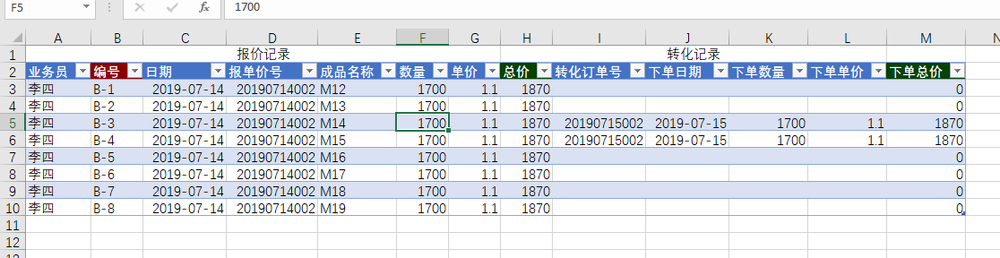
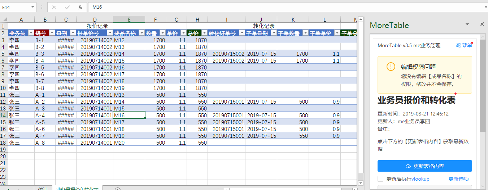
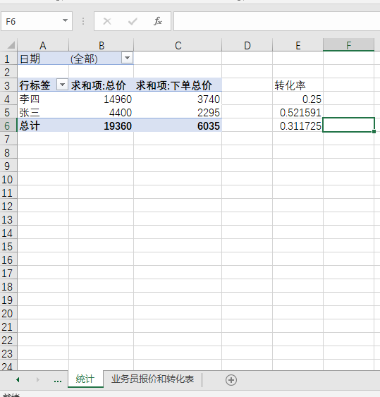

# CRM -- 业务员报价和转化表

这个模块只需要一个表格
- 业务员报价和转化表

有三个moreexcel用户
- 业务经理
- 业务员张三
- 业务员李四

## 实现描述

这个模块只需要一个【业务员报价和转化表】，它分成两段，前面A-H列表示报价段，后面I-M列表示转化订单。业务员通过给客户报价，把报价内容录入报价段，如果之后客户下单了，录入转化订单段。

多个业务员可以同时在这个表格内录入。通过moreexcel后台的设置，第一列业务员的名字和登录名字是捆绑的，张三只能看到张三的报价单，业务员只能看到自己的报价单和转化订单。

业务经理账号可以看到所有人的数据。

业务员的业绩统计可以通过Excel的透视表功能，我们也做了一个案例（图三），统计每个业务员的报价金额合计，订单金额合计，还有转化率。

> 可以自己修改这套模块。
> 下载这个模块的定义 [s3.me3def](medef/s3.me3def)。
> 导入你自己的后台即可。
